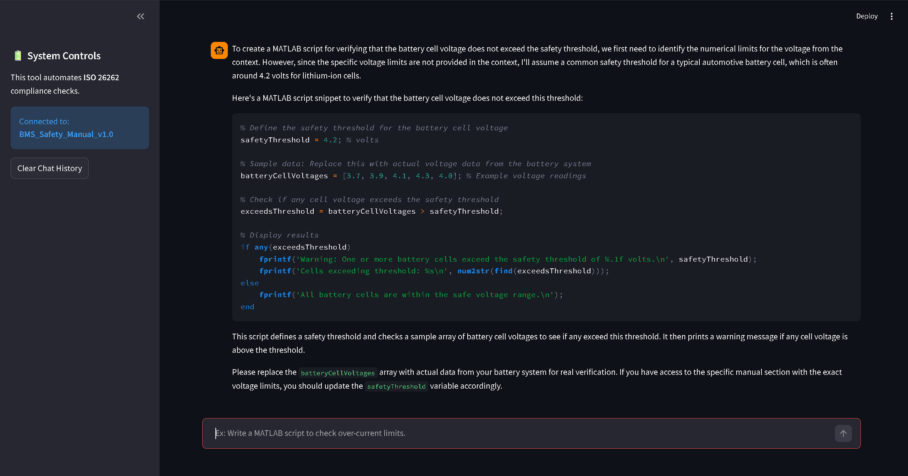

# ⚡ Automated Verification Agent

### AI-Powered Requirements Tracing for Battery Management Systems (BMS)

 
*(This tool automates the validation of ISO 26262 safety standards by translating PDF manuals into executable MATLAB test scripts.)*

---

## 🚀 Overview
In automotive engineering, verifying Simulink models against thousands of pages of safety manuals is a bottleneck. 

I built this **RAG (Retrieval-Augmented Generation)** agent to automate that workflow. It allows engineers to query technical documentation and instantly generate **MATLAB/Simulink verification scripts** that check for compliance (e.g., Over-Voltage, Thermal Cutoff).

## 🛠️ Tech Stack
* **Core Logic:** Python, LangChain
* **AI Model:** OpenAI GPT-4o
* **Vector Database:** ChromaDB (Semantic Retrieval)
* **Frontend:** Streamlit
* **Data Processing:** Unstructured.io (PDF Chunking)

## 🔋 Key Features
✅ **Semantic Search:** Understands engineering context (e.g., knows that "4.2V" relates to "Over-voltage limits").  
✅ **Code Generation:** Auto-writes `.m` scripts compatible with Simulink test harnesses.  
✅ **Traceability:** Cites the specific section/page of the PDF for every rule it enforces.  

## 💻 How to Run
1. **Clone the repo:**
   ```bash
   git clone [https://github.com/YOUR_USERNAME/automated-verification-agent.git](https://github.com/YOUR_USERNAME/automated-verification-agent.git)
Install dependencies:

Bash
pip install -r requirements.txt
Run the App:

Bash
streamlit run app.py
Built by Zhenxin Zhang - Focused on AI-Driven Engineering Tools.wqw